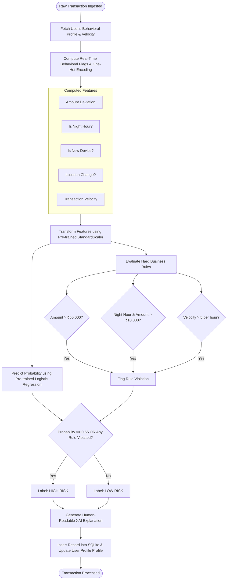

# 🛡️ COGNITIVE SHIELD — Real-Time AI Behavioral Fraud Detection

[](https://www.python.org/)
[](https://streamlit.io/)
[](https://scikit-learn.org/)
[](https://www.sqlite.org/)

An advanced, real-time hybrid Machine Learning and rule-based fraud detection system designed for digital payment ecosystems (such as UPI and mobile wallets). By going beyond traditional transaction-level rule checks, **COGNITIVE SHIELD** models user behavioral patterns—including transaction velocities, location shifts, device fingerprint changes, and abnormal transaction amounts—providing explainable AI insights (XAI) and real-time risk scoring.

---

## 👥 Team & Track Details
* **Team Name:** Syntex Squad
* **Track:** Open Innovation
* **Problem Statement:** Developing a next-generation fraud detection system that goes beyond traditional transaction monitoring by analyzing behavioral financial patterns, contextual signals, and adaptive risk scoring to proactively identify suspicious financial activity in digital payment ecosystems.

### Team Members
| Name | University Roll No. |
| :--- | :--- |
| **Ritesh Yadav** | 1230439247 |
| **Radhika Bhadauriya** | 1230439235 |
| **Nootan Tiwari** | 1230439206 |
| **Riya Singh** | 1230439249 |

---

## 🏗️ System Architecture

```mermaid
graph TD
    A[UPI / Wallet Simulator / Manual Entry] -->|Raw Transaction| B(Transaction Process Pipeline)
    B --> C{Fetch User History}
    C -->|SQLite Queries| D[(SQLite DB: user_profiles)]
    D -->|User Profile Context| E[Feature Engineering Module]
    A -->|Current Txn Details| E
    
    E -->|Compute 24 Features| F[Hybrid Risk Assessment Engine]
    
    subgraph Engine [Hybrid Risk Assessment Engine]
        F1[StandardScaler + ML Model: Logistic Regression]
        F2[Deterministic Business Rules Validator]
    end
    
    F --> F1
    F --> F2
    
    F1 -->|Risk Probabilities & Feature Coefficients| G[XAI - Feature Influence Score Builder]
    F2 -->|Flagged Violations| H[Risk Decision Boundary]
    G --> H
    
    H -->|Classified Output| I[SQLite DB: transactions]
    H -->|Dynamic Alerts & Stats| J[Streamlit Analytics Dashboard]
    
    style Engine fill:#1e1b4b,stroke:#6366f1,stroke-width:2px;
```



---

## 🧠 Transaction Prediction Pipeline Flow



---

## 🌟 Key Features

* **Real-Time Detection**: Evaluates incoming transactions immediately using a pre-trained machine learning model and computes adaptive risk scoring.
* **Explainable AI (XAI)**: Generates human-readable descriptions of flagged behaviors and provides visual graphs illustrating feature impact (using model coefficients).
* **Deterministic Rules Engine**: Acts as a backup safety net to flag high-value transactions, night transactions, and rapid velocity spikes regardless of ML thresholds.
* **Lightweight SQLite Backend**: Keeps a persistent log of transaction histories and updates running averages of user behavioral profiles.
* **Visual Analytics Dashboard**: Interactive graphs built with Plotly showing hourly volume trends, location breakdowns, risk distributions, and merchant distributions.
* **Synthetic Transaction Simulator**: A multi-threaded simulation system generating realistic payment behavior for 20 synthetic users with options to configure custom fraud ratios.

---

## 📁 Repository Layout

```
FINTECHAI/
├── models/
│   └── fraud_detection_model.joblib    # Pre-trained ML model & scaler bundle
├── database/
│   └── fraud_detection.db              # SQLite backend storage (auto-created)
├── src/
│   ├── __init__.py
│   ├── database_manager.py             # SQLite setup, transaction, and user history logs
│   ├── data_processing.py              # Behavioral feature extraction and OHE alignment
│   ├── fraud_prediction.py             # Inference pipeline, rule evaluation, and XAI
│   ├── simulator.py                    # Multi-threaded synthetic transaction stream generator
│   └── dashboard.py                    # Streamlit web dashboard and visualization panels
├── test_system.py                      # Comprehensive automated test suite
├── requirements.txt                    # Python library requirements
└── README.md                           # Professional project documentation
```

---

## 🛠️ Installation and Execution Guide

### Prerequisites
* Python 3.11 or higher installed on your machine.

### 1. Set Up Your Environment
Clone the repository and install all required python libraries:
```bash
pip install -r requirements.txt
```

### 2. Run Automated Verification Tests
Run the comprehensive verification script to confirm everything is running correctly:
* **Windows (PowerShell/CMD)**:
  ```powershell
  set PYTHONIOENCODING=utf-8 && python test_system.py
  ```
* **Linux / macOS**:
  ```bash
  python test_system.py
  ```

### 3. Launch the Web Interface
Start the Streamlit dashboard server:
```bash
python -m streamlit run src/dashboard.py
```
Open your browser and navigate to **`http://localhost:8501`** to interact with the platform.

---

## ⚙️ Model Specification & Columns

The pre-trained model bundle (`models/fraud_detection_model.joblib`) performs binary classification utilizing **24 distinct features**:

| Index | Feature Column Name | Type | Description |
|---|---|---|---|
| 1 | `amount` | Numeric | The current transaction amount in ₹ |
| 2 | `hour` | Numeric | Hour of the transaction (0-23) |
| 3 | `user_id` | Categorical | Unique ID of the user account |
| 4 | `avg_user_amount` | Numeric | User's historic average transaction size |
| 5 | `amount_deviation` | Numeric | Deviation from user's usual spending habits |
| 6 | `is_night` | Binary | Flag for transactions occurring between 12 AM – 6 AM |
| 7 | `is_new_device` | Binary | Flag if device model differs from previous transaction |
| 8 | `location_change_flag`| Binary | Flag if location differs from usual location |
| 9 | `is_new_merchant` | Binary | Flag if the user interacts with a new merchant |
| 10 | `transaction_velocity` | Numeric | Number of transactions initiated within the last hour |
| 11-15 | `location_*` | One-Hot | Categorical encoding for Cities (Mumbai, Delhi, Bangalore, etc.) |
| 16-19 | `device_id_*` | One-Hot | Categorical encoding for Devices (Android_A, iPhone_X, etc.) |
| 20-24 | `merchant_id_*` | One-Hot | Categorical encoding for UPI Merchants (paytm@upi, gpay@upi, etc.) |
